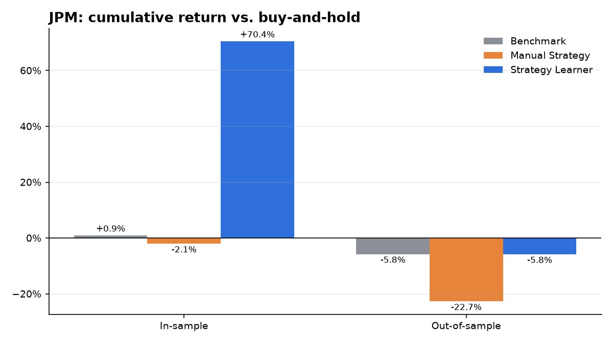
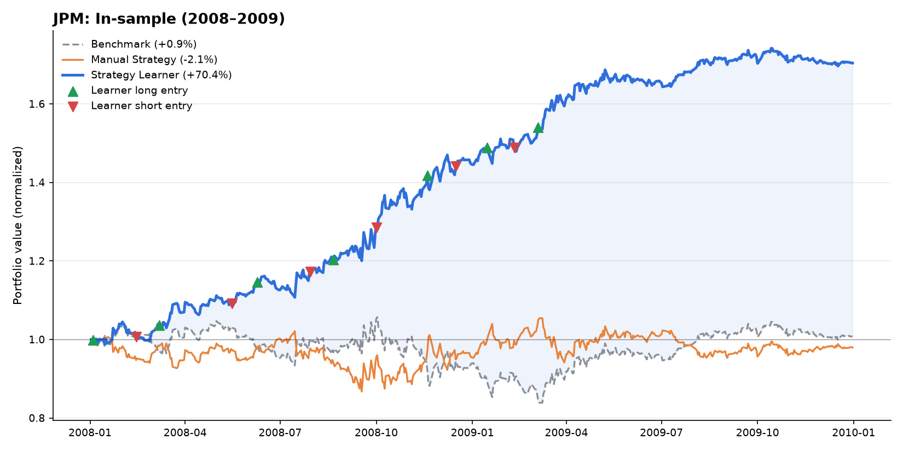
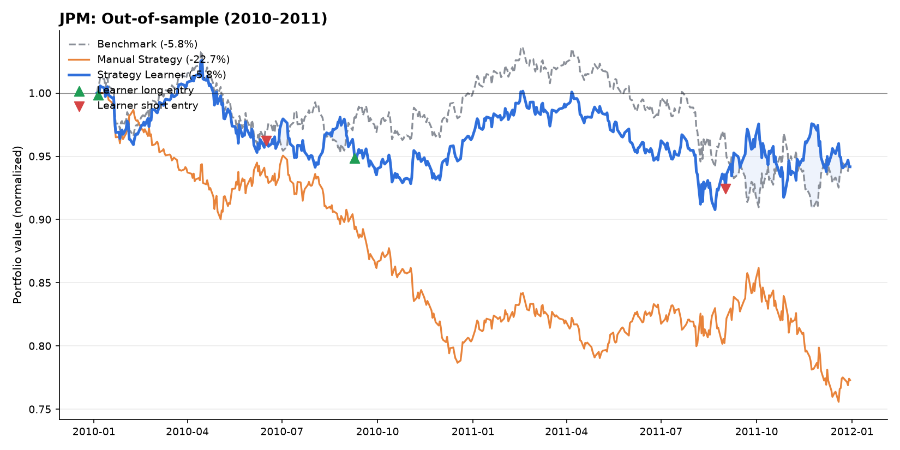
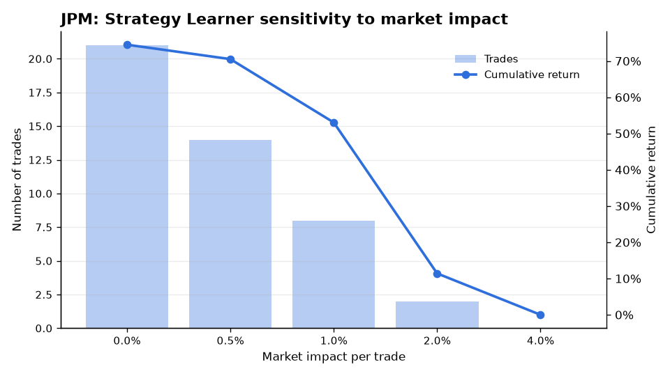

# Random Forest Trading Engine


A backtesting engine that pits a machine-learning trading strategy — a bagged ensemble of random decision trees (a random forest) trained on technical indicators — against a hand-coded, rule-based strategy and a buy-and-hold benchmark. Every simulated trade pays commission and market impact.



## Results

Both strategies trade JPM with $100,000 starting capital, can hold -1000, 0, or +1000 shares, and pay a $9.95 commission and 0.5% market impact on every trade. The learner is trained on 2008–2009 only and then evaluated on unseen 2010–2011 data.

### In-sample (2008–2009)



| Strategy | Cumulative return | Sharpe ratio | Daily std. dev. | Trades |
| --- | ---: | ---: | ---: | ---: |
| Buy-and-hold benchmark | +0.9% | 0.11 | 1.15% | 1 |
| Manual (rule-based) strategy | -2.1% | 0.03 | 1.16% | 13 |
| **Strategy Learner** | **+70.4%** | **2.09** | **0.83%** | 14 |

Through the 2008 financial crisis the learner went both long and short. It returned +70% with lower volatility than simply holding the stock, which ended roughly flat.

### Out-of-sample (2010–2011)



| Strategy | Cumulative return | Sharpe ratio | Daily std. dev. | Trades |
| --- | ---: | ---: | ---: | ---: |
| Buy-and-hold benchmark | -5.8% | -0.28 | 0.58% | 1 |
| Manual (rule-based) strategy | -22.7% | -1.18 | 0.66% | 19 |
| **Strategy Learner** | **-5.8%** | **-0.28** | **0.58%** | 5 |

On unseen data the learner trades far less and roughly matches the benchmark, while the rule-based strategy loses 22.7%. The drop from in-sample to out-of-sample performance is the usual overfitting gap for a model trained on a single, unusually volatile two-year regime. Closing that gap is the main direction for future work (see below).

### Sensitivity to market impact



When labeling training data, the learner widens its buy/sell thresholds as market impact grows, so it only targets moves large enough to cover trading costs. Higher impact therefore means fewer trades, and at 4% impact it stops trading altogether.

## How it works

1. **Indicators** (`indicators.py`): Bollinger %B, RSI, MACD histogram, 14-day momentum, and the 12/26-day EMA crossover spread. `build_features` loads a warm-up window before the start date, so every indicator is valid from the first trading day.
2. **Labels** (`StrategyLearner.py`): each training day is labeled buy (+1), sell (-1), or hold (0) based on its 15-day forward return, with thresholds of ±2% widened by market impact.
3. **Model** (`RTLearner.py`, `BagLearner.py`): 50 random trees (each split uses a random feature at its median) are trained on bootstrap samples, and their predictions are averaged into a score between -1 and 1.
4. **Policy**: go long or short when the score passes ±0.4, hold each position for at least 15 days, and close out on the final day. The threshold was tuned on in-sample data only.
5. **Simulation** (`marketsimcode.py`): computes daily portfolio value from trades, including commission and market impact.

`ManualStrategy.py` applies the same five indicators with fixed, hand-weighted voting rules, as a baseline for what the learner adds.

## Project layout

| File | Description |
| --- | --- |
| `RTLearner.py` | Random tree regression learner |
| `BagLearner.py` | Bootstrap aggregating ensemble around any base learner |
| `indicators.py` | Technical indicators and the shared feature pipeline |
| `ManualStrategy.py` | Rule-based strategy |
| `StrategyLearner.py` | Random forest strategy |
| `marketsimcode.py` | Market simulator and performance statistics |
| `experiment.py` | Runs the full comparison and generates the charts |
| `fetch_data.py` | Downloads price data from Yahoo Finance |
| `util.py` | Price data loading |
| `tests/` | Unit tests (run on synthetic data, no network needed) |

## Getting started

```bash
python -m venv .venv && source .venv/bin/activate
pip install -r requirements.txt

python fetch_data.py          # downloads SPY and JPM (2007–2012) into data/
python experiment.py          # prints statistics and writes charts to images/
pytest                        # runs the test suite
```

To use the strategies directly:

```python
import datetime as dt
from StrategyLearner import StrategyLearner

learner = StrategyLearner(impact=0.005, commission=9.95)
learner.add_evidence(symbol="JPM", sd=dt.datetime(2008, 1, 1), ed=dt.datetime(2009, 12, 31), sv=100000)
trades = learner.testPolicy(symbol="JPM", sd=dt.datetime(2010, 1, 1), ed=dt.datetime(2011, 12, 31), sv=100000)
```

`trades` is a DataFrame of daily share changes that you can pass to `marketsimcode.compute_portvals_from_trades`.

## Future work

- Walk-forward (rolling) retraining instead of a single fixed training window
- Evaluate across a basket of symbols rather than one stock
- Classification (majority-vote) leaves and probability-calibrated position sizing
